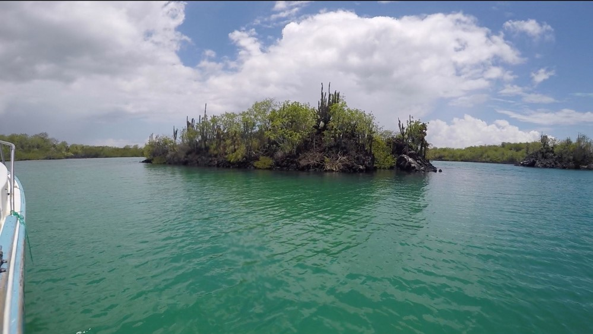
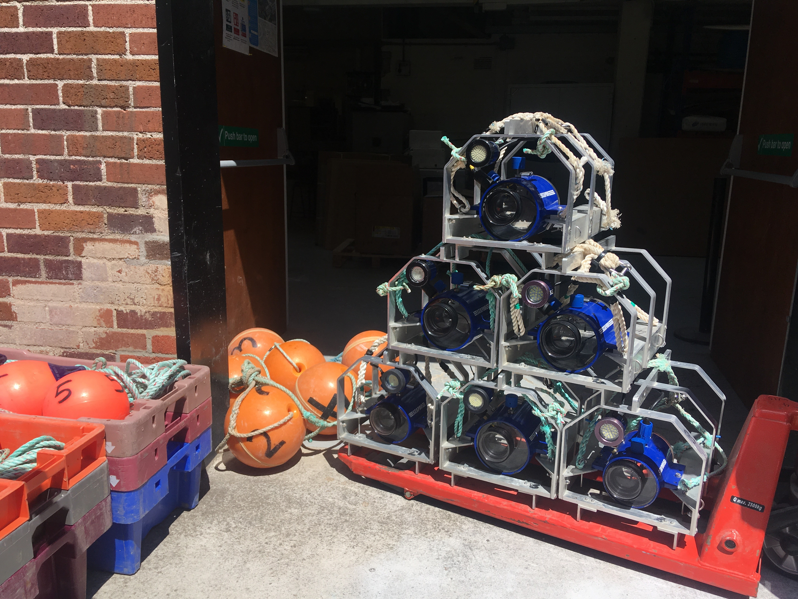
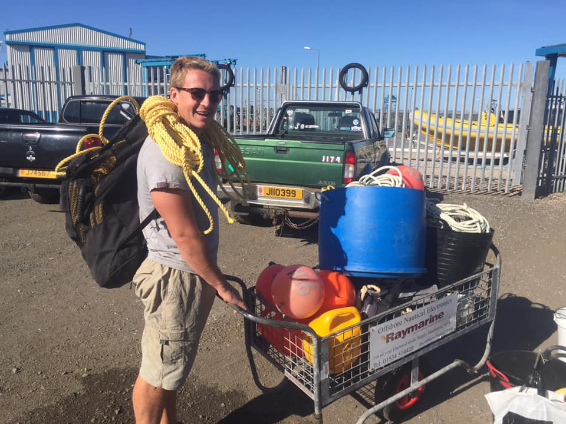
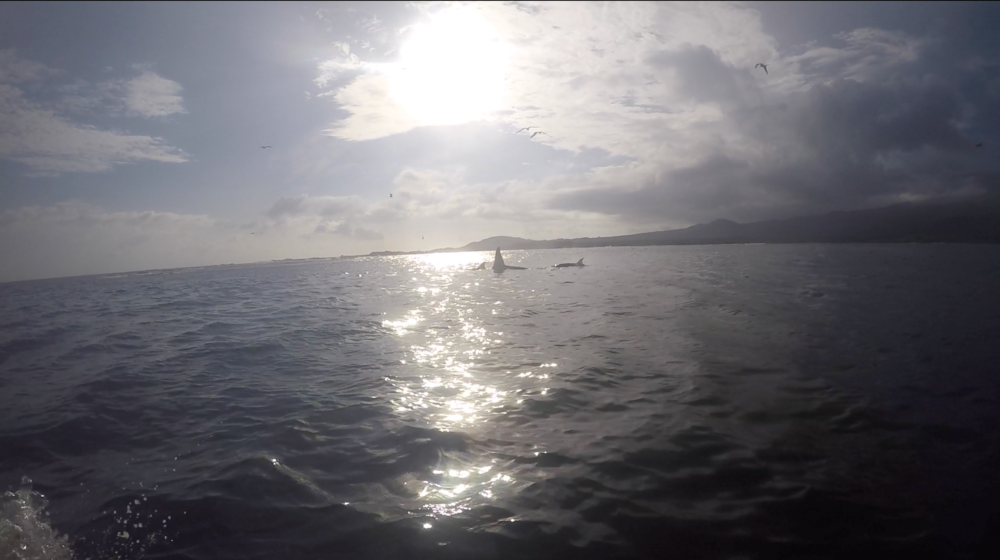

# Who am I? 

My name is Bede Ffinian Rowe Davies a Post-Doctoral Researcher in Marine Ecology. 

::: {.floatting}

```{r , echo=FALSE,out.width='50%', out.extra='style="float:right; padding:10px"'}
knitr::include_graphics("Images/index/Bede.png")

```


I completed my PhD based at the University of Plymouth. The title of my PhD was: **The Effectiveness of Partially Protected Marine Areas for Ecosystem Based Fisheries Management.**  The work centred around the Marine Protected Area (MPA) in Lyme Bay (UK), which excluded all demersal towed fishing activity across 206km$^2$ of seabed in 2008. University of Plymouth staff and students have monitored the benthic environment across the bay (inside and outside the MPA) annually, using a range of underwater sampling equipment. The methods include Passive Acoustic Monitoring (PAM), Towed Underwater Video Systems (TUVs) and Baited Remote Underwater Video Systems (BRUVs). The objective of my PhD was to assess how the protection affected the benthic ecosystems inside vs outside the MPA. My duties included: the continued application of annual surveys alongside other members of the team; organisation of the 12 year data sets for BRUVs and TUVs, and 5 years of PAM recordings; analysis of BRUVs and PAM data sets, statistical analysis of the time series data; assessment of the applicability of the methods and the creation of journal style articles for publication. Since completing my PhD, I have been employed as an Assistant Project Manager and Post-Doctoral Researcher delivering monitoring goals within the team with whom I completed my PhD. 

:::


# What do I do?
::: {.floatting}

```{r , echo=FALSE,out.width='50%', out.extra='style="float:left; padding:10px"'}
knitr::include_graphics("Images/index/Cores.png")

```

I am currently a Post-Doctoral researcher at the University of Plymouth assessing changes in Blue Carbon stores around Jersey in the UK Channel Islands. The project aims to assess the stored carbon within sedimentary habitats in Jersey. This infomation is then being used alongside spatial habitat data to create a preliminary estimate of total carbon within sedimentary habitats across Jersey's territorial waters. Cores and Grabs were taken across Jersey's waters, then prepared and analysed for their total and organic carbon content with CHN analysis.

:::

# Experience

```{r , echo=FALSE,out.width='100%', out.extra='style="padding:10px"'}


```

## Projects

::: {.floatting}

```{r , echo=FALSE,out.width='50%', out.extra='style="float:left; padding:10px"'}


```


I have worked and assisted in many projects across the UK including: **Long term MPA Assessment**, **Ecological Impact Assessment of a 50 Year Storm**, **Fisheries Stock Assessment**, **Seagrass Mapping**, **Wave Energy**, **Device Impact Assessment**, **Offshore Aquaculture Impact Assessment**, **Sedimentary Blue Carbon Assessment** & **Acoustic Assessments of Marine Soundscapes**.

Further afield, I have also worked in: 

- the Galapagos Islands assessing both Plastic Pollution and Biological Invasive species

- the Ecuadorian fisheries department (Instituto Nacional de Pesca) asssessing bycatch of protected species

- the Himalayan mountains and the Ganges River alongside National Geographic researchers assessing plastics.  

```{r , echo=FALSE,out.width='50%', out.extra='style="float:right; padding:10px"'}


```


Through this work I have collaborated with researchers from across the globe and across many disciplines combining in-the-field research (Underwater videography (BRUVs), boatwork, snorkelling, SCUBA, intertidal estuary surveys) and in the lab (Sediment core and grab preparation). Often, I have then been responsible for data organisation, analysis and presentation.

:::

## Methods

::: {.floatting}

```{r , echo=FALSE,out.width='50%', out.extra='style="float:right; padding:10px"'}
knitr::include_graphics("Images/index/MonthlyCurrentFacet.gif")

```

The statistical analyses have ranged from assessing changes in acoustic complexity index (a univariate measure of ecosystem noise), to assemblage level changes (multivariate) and from abundance and diversity of taxa of importance, to whole ecosystem functional trait analysis. The methods used have mostly been applied within the coding language {r}, with models being applied of varying complexity,in both frequentist and bayesian frameworks, from one or two fixed effects to more complex mixed effects, hierarchical models and General Additive Models. These models, as the data have been varying in distributions and characteristics, have been similarly variable, with models using gaussian, poisson, beta, gamma and bernoulli/binomial distributions and zero-inflated/zero-altered (hurdle etc) alternatives.  These analysis methods have been used to provide visiualisations of predicted scenarios across many of the projects.


:::

```{r , echo=FALSE,out.width='100%', out.extra='style="padding:10px"'}


```

